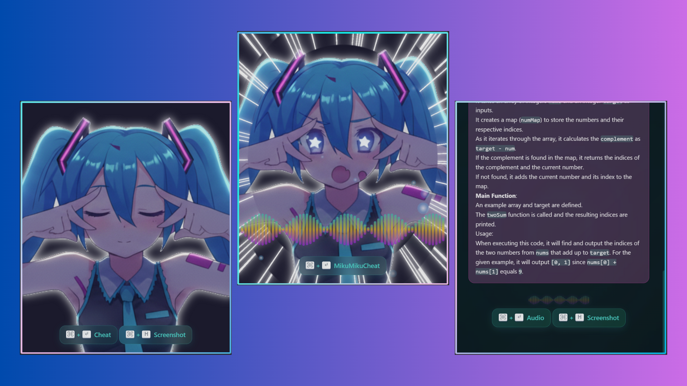

<div align="center">
    
    <h1 style="font-family: 'Yu Gothic'">MikuMikuCheat</h1>
    <p style="font-style: italic">Cheat your interviews with Miku's help.</p>
</div>

## What is this?

A real-time interview assistant that's invisible on calls. It captures your screen audio, transcribes it, and provides concise, AI-powered answers to keep you one step ahead.

- Audio assistant
- Screenshot troubleshooter
- Not visible on live calls


[](https://www.youtube.com/watch?v=3-MetMz-af0)


## Getting Started

### Prerequisites

- Go 1.23 or later
- Node.js (which includes npm)

### Installation

1.  Clone the repository
2.  Create a `config.json` file based on `config.json.example`
3.  Run the application:
    ```bash
    wails dev
    ```

## Building for Production

To build a production version of the application, run:

```bash
wails build
```

This will create a distributable binary in the `build/bin` directory.

## Tech Stack

- **Backend:** Go, Wails
- **Frontend:** React, TypeScript, Vite

## Roadmap

- [x] Available on Windows
- [x] Support for audio conversations
- [x] Support for screenshots
- [ ] Available on Linux
- [ ] Available on MacOS
- [ ] Support for personal context